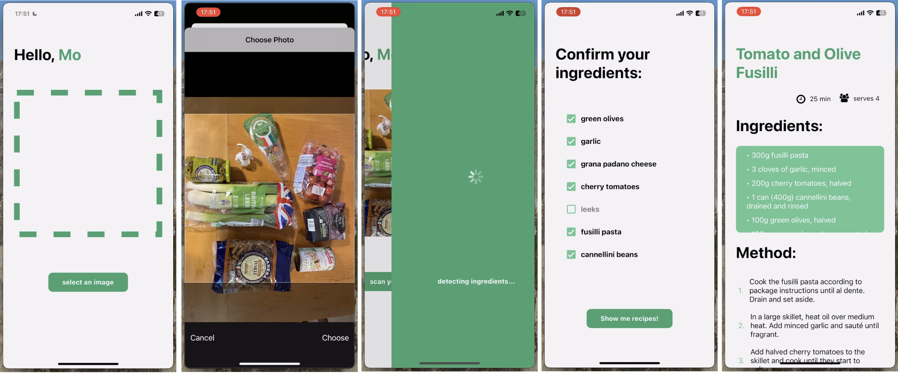

# Recipe Bot

This repository contains the code for a PoC recipe bot mobile app. The app uses openAI APIs to provide users with recipes based on the ingredients they have in their cupboards.

## Please note:

This is a PoC and has the following urgent to-dos:

- Styling has been added ad-hoc and needs refactoring throughout
- Nested virtualised lists in Recipe screen needs fixing

## Features

- Automatic detection of ingredients using openAI vision API
- Optional filtering of unwanted ingredients
- Recipe suggestions based on ingredients selected using openAI GPT3.5Turbo

## Next steps

- Use instructor for enforce structured outputs

## Contributing

Contributions are welcome! If you have any ideas or improvements, feel free to open an issue or submit a pull request.
